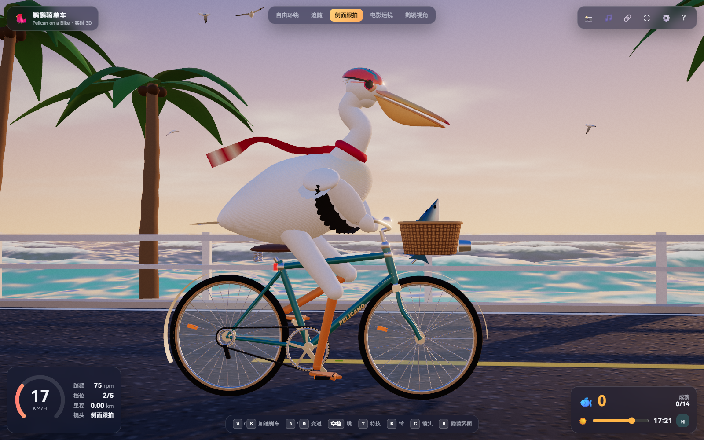
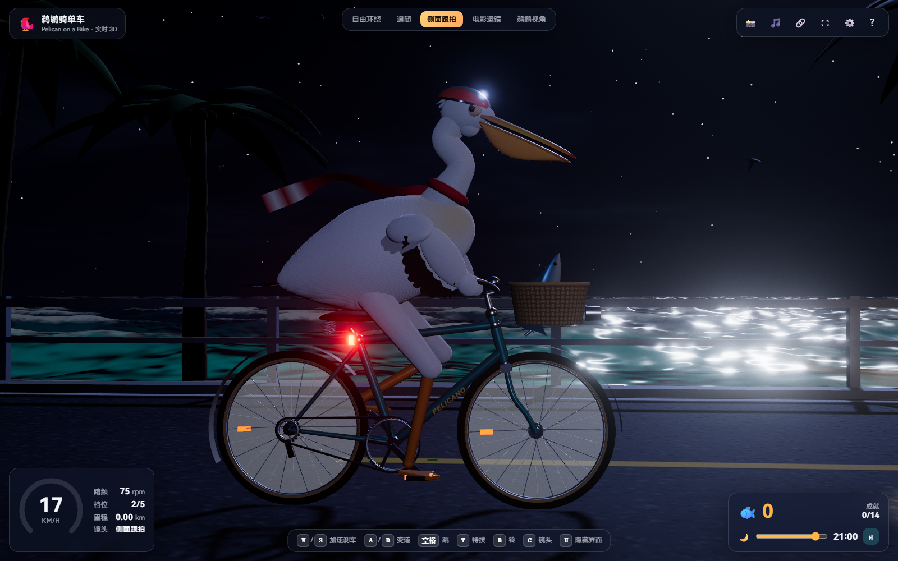
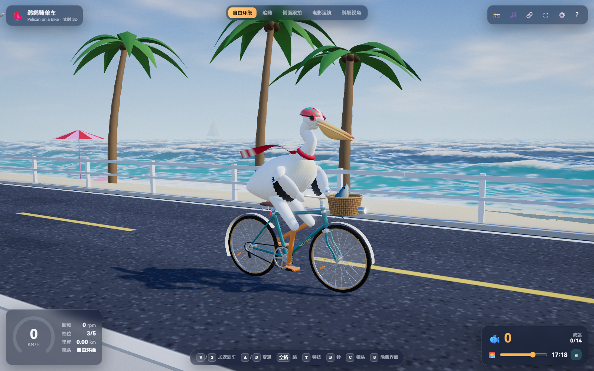

# Pelican Bike · 鹈鹕骑单车

一只戴着头盔、系着红围巾的鹈鹕，骑着复古单车沿海岸追鱼。

这是一个可直接在浏览器里打开的实时 3D 互动场景。踩踏、海浪、围巾、昼夜和音乐一起流动；你可以自己骑，也可以让它自动驾驶，挑一个镜头看海。

**单文件 HTML · Three.js / WebGL · 五种镜头 · 昼夜循环 · 无需构建**



## 看看沿途

| 夜间骑行 | 自由视角 |
| --- | --- |
|  |  |
| 时间持续流动，海岸从白昼走入夜晚。 | 拖动鼠标换个角度，近看踩踏与围巾。 |

## 可以怎么玩

- **沿海追鱼**：加速、刹车、左右变道，接近鱼群收集分数；金色的鱼值 5 分。开启自动驾驶后，闲置几秒会自动追鱼。
- **做点小动作**：跳跃、放手展翅、抬起前轮，按一下车铃，或者让鹈鹕大叫。
- **切换五种镜头**：自由环绕、追随、侧面跟拍、电影运镜和鹈鹕视角。
- **等一场日落**：让时间自然流动，也可以用滑块选择时刻、暂停时间，或一次快进 3 小时。
- **听见骑行**：车铃、叫声、滑行声和实时合成的背景音乐；音乐节奏会跟随踏频变化。
- **调整自己的风景**：参数面板提供画质、云量、浪高、雾、泛光、曝光，以及头盔、墨镜、围巾等选项。
- **留下这一帧**：一键保存 PNG 截图，隐藏界面后专心看风景。部署到网站后，分享按钮会生成包含当前时刻与镜头的链接。

## 开始骑行

1. 下载仓库 ZIP 并解压，或者克隆仓库。
2. 双击根目录的 **`index.html`**，用当前版本的 **Chrome 或 Edge** 打开。
3. 点击「开始骑行」；想安静看看，可以选择「静音进入」。

不需要安装 Node.js，不需要 `npm install`，也不需要后端。页面脚本、样式与场景都包含在 HTML 中，不依赖外部模型或贴图。

浏览器需要支持 WebGL，建议开启硬件加速。若画面不够流畅，打开右上角 ⚙️，在「画面」中把画质调为「流畅」，或关闭泛光。触屏设备可使用页面中的方向、跳跃与特技按钮；实际流畅度取决于设备。

## 常用操作

| 操作 | 按键 / 手势 |
| --- | --- |
| 加速 / 刹车 | `W` / `S`，或 `↑` / `↓` |
| 左右变道 | `A` / `D`，或 `←` / `→` |
| 跳跃 / 展翅特技 | `Space` / `T` |
| 按铃 / 鹈鹕叫声 | `B` / `H` |
| 切换镜头 | `C`，或顶部镜头按钮 |
| 旋转 / 缩放视角 | 拖动 / 鼠标滚轮 |
| 时间快进 3 小时 | `N` |
| 暂停 / 继续 | `P` |
| 隐藏 / 显示界面 | `U` |
| 截图 / 全屏 | `K` / `F` |

完整键位、鼠标互动和参数说明见 **[操作指南](docs/CONTROLS.md)**。

## 场景是怎样组成的

场景通过 Three.js 和 WebGL 实时渲染。鹈鹕与单车使用程序化几何，双骨骼 IK 让脚部跟随踏板，围巾使用 Verlet 布料模拟，海面使用 Gerstner 波。声音通过浏览器音频接口实时合成。

当前版本将运行代码与依赖集中在 `index.html` 中，因此下载、打开和部署都很直接。编辑交互或场景逻辑时，需要在这个文件中修改；它不是拆分好的模块化开发工程。

## 目录

```text
pelican-bike/
├── index.html                 # 可直接打开的完整场景
├── README.md                  # 项目介绍
└── docs/
    ├── CONTROLS.md            # 完整操作指南
    └── images/
        ├── coastal-ride.png   # 海岸骑行
        ├── night-ride.png     # 夜间骑行
        └── free-view.png      # 自由视角
```

## 部署到静态网站

这个项目没有服务端逻辑，只需让静态托管服务提供根目录的 `index.html`。

**GitHub Pages** 可以直接从仓库发布：

1. 打开仓库的 **Settings → Pages**。
2. 在 **Build and deployment** 中选择 **Deploy from a branch**。
3. 选择 `main` 分支和 **`/ (root)`**，保存。
4. 等待部署完成，访问 Pages 设置页显示的地址。

其他静态托管服务同样适用：不设置构建命令，将仓库根目录作为发布目录即可。页面内的分享按钮适合在已部署的 HTTPS 网站上使用；本地 `file://` 地址不能作为他人的访问入口。
